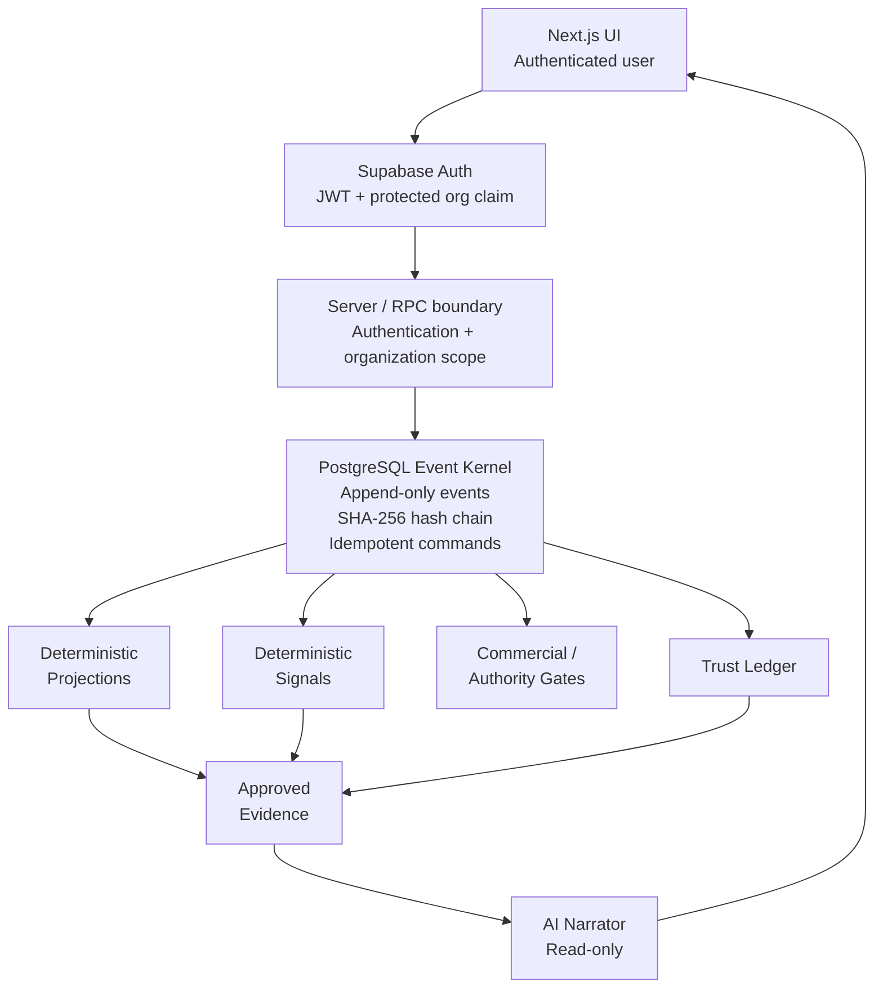

# Signet

**Verified operations infrastructure for service firms.**

Signet is a production-style operations control system built around an append-only event kernel, deterministic business logic, authenticated security boundaries, tamper-evident operational evidence, and a constrained read-only AI narration layer.

**Live application:** https://signet-chi.vercel.app

**Repository:** https://github.com/murrayglenn75-beep/signet

---

## What Signet is

Most AI-enabled operational systems start by giving the model access to business data and then asking it to decide what should happen.

Signet takes the opposite approach.

```text
authenticated event
        ↓
deterministic state
        ↓
deterministic signal
        ↓
policy / authority gate
        ↓
verified evidence
        ↓
AI explanation
```

The system establishes operational truth before AI is allowed to participate.

The LLM can explain what the system knows.

It cannot decide what is true.

---

## Why I built it

Service businesses often operate across disconnected project, time, budget, invoice, and commercial-decision systems.

That creates problems such as:

- scope expanding without commercial approval
- budget overruns being noticed too late
- invoices not reconciling with underlying work
- operational decisions losing their evidence trail
- dashboards showing state without explaining where it came from
- AI being given more authority than the underlying data deserves

Signet treats those as **systems and authority problems**, not prompting problems.

The architecture is designed around one principle:

> **Truth first. AI second.**

---

## Product

### Command Center

The Command Center provides a portfolio-level operational view including:

- portfolio margin
- revenue at risk
- unbilled exposure
- active engagements
- engagement health
- deterministic risk signals
- evidence-backed AI narration
- Trust Ledger status

No model is used to calculate the underlying operational state.

---

### Engagements

Engagement state is reconstructed from authenticated operational events and deterministic projections.

The view includes:

- client
- fee model
- planned hours
- approved scope
- hours consumed
- margin
- budget burn
- unbilled exposure
- commercial health
- active risk state

---

### Signals

Risk detection is deterministic.

Current signal types include conditions such as:

- budget exhaustion
- budget pressure
- unreconciled financial state

Signals contain:

- severity
- signal code
- affected operational stream
- deterministic detail
- exact evidence sequence references
- calculation timestamp

The LLM cannot create, modify, escalate, or clear a signal.

---

### Change Orders

Fixed-fee scope expansion is protected behind an explicit commercial authority boundary.

A change order can be:

- approved
- absorbed
- declined

Decisions pass through an idempotent command path that handles:

- authenticated identity
- organization scope
- duplicate requests
- conflicting decisions
- concurrency
- event creation
- immutable receipts

A successful decision produces a verified event receipt.

---

### Trust Ledger

The Trust Ledger exposes authenticated operational evidence without giving the browser unrestricted access to raw event payloads.

It provides bounded metadata including:

- event sequence
- event ID
- event type
- stream identity
- actor type
- timestamp
- previous hash
- current event hash

The operational event chain is **tamper-evident**, not claimed to be universally tamper-proof.

---

## Public demo workspace

The production application includes an isolated read-only demo workspace.

Select:

**Enter demo workspace**

from the login screen.

The demo uses real Supabase authentication rather than a frontend authentication bypass.

The server performs the demo login using environment-managed credentials, then verifies that the resulting authenticated identity contains the expected protected claims.

The demo workspace has its own organization identity:

```text
production organization
        ≠
demo organization
```

The database boundary prevents authenticated demo users from writing operational events or commercial commands.

The demo therefore allows exploration of:

- Command Center
- engagement state
- deterministic signals
- change orders
- Trust Ledger
- AI narration

without granting authority to change the seeded operational state.

---

## Architecture



The event stream is the operational source of truth.

Projections, signals, receipts, commercial decisions, ledger evidence, and AI narration are downstream of controlled event boundaries.

---

## Event kernel

Operational mutations are expressed as events rather than silent state replacement.

Examples include:

```text
engagement.created
budget_line.created
time_entry.logged
invoice.drafted
change_order.requested
change_order.decided
```

Historical operational events are append-only under normal application flows.

Corrections are represented by new events rather than rewriting previous operational history.

---

## Core invariants

### Events are append-only

Application workflows do not update or delete historical operational events.

### State is deterministic

Projection state is calculated from known event transitions.

### Signals are deterministic

Operational risk is computed by system logic rather than model judgment.

### Evidence is explicit

Signals point to exact event sequences.

### Identity is server-bound

Organization and actor identity are derived from authenticated context rather than trusted caller input.

### Commercial authority is explicit

Fixed-fee scope expansion cannot silently bypass the change-order boundary.

### Sensitive commands are idempotent

Retries cannot silently create duplicate commercial decisions.

### Concurrency is considered

Conflicting commercial operations are serialized or rejected under the implemented command model.

### AI has no operational authority

AI receives approved evidence for explanation only.

---

## Security architecture

Signet uses layered trust boundaries rather than depending on frontend checks.

### Authentication

Production authentication uses Supabase Auth.

Protected application routes require an authenticated session.

Public self-registration is intentionally not exposed.

---

### Organization boundary

Authenticated JWTs contain an organization claim generated through a Supabase Custom Access Token Hook.

The database uses this authenticated organization identity to scope reads and protected RPC operations.

The client does not get to choose its organization authority.

---

### Demo isolation

The demo user receives protected authentication metadata identifying:

```text
demo_mode = true
```

and the dedicated demo organization.

Database-side protection rejects operational writes from demo-authenticated identities.

This means read-only demo behavior is not dependent only on disabled frontend controls.

---

### Write boundary

Operational writes are performed through controlled database functions rather than unrestricted client table writes.

The boundary covers:

- authentication
- organization binding
- actor binding
- caller identity anti-spoofing
- cross-organization reference protection
- commercial policy enforcement
- command idempotency

---

### Change-order command boundary

Change-order decisions use a dedicated idempotent command path.

The system:

1. accepts the command
2. binds it to authenticated context
3. reserves the idempotency key
4. serializes conflicting decisions
5. rejects conflicting key reuse
6. executes the event-kernel operation
7. returns a verified receipt

Safe retries return the original operation rather than generating silent duplicates.

---

### Verified receipts

Sensitive commands can return a receipt containing:

- event sequence
- event ID
- event hash
- occurred-at timestamp
- stream type
- stream ID
- event type

The browser therefore does not require direct unrestricted access to the underlying operational event table to confirm that an operation was recorded.

---

## Tamper-evident ledger

Each operational event participates in a PostgreSQL SHA-256 hash chain.

Conceptually:

```text
event[n].hash =
SHA256(
    previous_hash
    +
    canonical_event_data
)
```

Each organization maintains its own chain state.

Unexpected modification to historical event material can therefore invalidate subsequent chain expectations under the implemented trust model.

Signet deliberately describes this mechanism as **tamper-evident** rather than tamper-proof.

A malicious database administrator or compromised infrastructure owner remains outside the current trust boundary.

Potential future hardening could include:

- independently signed checkpoints
- external WORM storage
- trusted timestamping
- third-party hash anchoring
- cross-system verification

---

## AI boundary

AI is downstream of authority.

The narrator may explain:

- why a signal exists
- which condition triggered it
- which evidence supports it
- which engagement is affected
- what operational attention may be required

It does not:

- determine financial truth
- authorize scope
- mutate operational state
- modify projections
- create signals
- clear signals
- act as the system of record

```text
deterministic state
        ↓
deterministic signal
        ↓
approved evidence
        ↓
AI explanation
```

This separation is a core architectural property of Signet.

---

## Technology

### Application

- Next.js 16
- React
- TypeScript
- Lucide React
- Vercel

### Data and authentication

- Supabase
- PostgreSQL
- Supabase Auth
- Row Level Security
- PostgreSQL RPC
- SECURITY DEFINER functions
- Custom Access Token Hook

### Event and security kernel

- append-only event architecture
- SHA-256
- pgcrypto
- per-organization hash chains
- deterministic reducers
- deterministic signal computation
- authenticated JWT claims
- idempotency keys
- evidence-scoped RPC boundaries

### Automation and verification

- pg_cron
- Vitest 4
- GitHub Actions
- Supabase CLI
- Docker

---

## Verification

Current automated test result:

```text
Test Files  5 passed (5)
Tests       29 passed (29)
```

The test suite covers areas including:

- acceptance behavior
- authenticated identity enforcement
- organization isolation
- security hardening
- fixed-fee scope enforcement
- change-order idempotency
- concurrency-sensitive command behavior
- Trust Ledger access boundaries
- verified command receipts
- demo authentication boundaries

The current production application also passes the production Next.js build.

The CI workflow is configured to run:

```bash
npm ci
npx supabase start
npx supabase db reset
npm test
npm run build
```

---

## Application routes

```text
/
├── /login
├── /engagements
├── /signals
├── /change-orders
├── /trust-ledger
└── /auth/demo
```

`/auth/demo` performs a real server-side demo authentication flow and is available in the production deployment.

---

## Local development

### Prerequisites

- Node.js 22+
- Docker Desktop
- Supabase CLI

Install dependencies:

```bash
npm install
```

Start local Supabase:

```bash
npx supabase start
```

Reset the local database and apply migrations:

```bash
npx supabase db reset
```

Create:

```text
.env.local
```

with your own development configuration:

```env
NEXT_PUBLIC_SUPABASE_URL=
NEXT_PUBLIC_SUPABASE_PUBLISHABLE_KEY=
```

Do not commit `.env.local`.

Start the application:

```bash
npm run dev
```

Open:

```text
http://localhost:3000
```

Run verification:

```bash
npm test
npm run build
git diff --check
```

---

## Production configuration

The Vercel application requires public Supabase configuration:

```text
NEXT_PUBLIC_SUPABASE_URL
NEXT_PUBLIC_SUPABASE_PUBLISHABLE_KEY
```

The demo authentication route also uses server-side environment configuration:

```text
DEMO_EMAIL
DEMO_PASSWORD
```

These values remain server-side.

The application does not expose the demo password in browser source.

A Supabase service-role credential is not required by the browser application.

---

## Database migrations

The complete migration history is stored under:

```text
supabase/migrations/
```

The migration set contains the original event kernel and subsequent production hardening for areas including:

- event append boundaries
- deterministic projections
- deterministic signals
- authenticated identity binding
- organization-scoped access
- Custom Access Token Hook claims
- change-order enforcement
- idempotent commands
- verified event receipts
- Trust Ledger RPC boundaries
- browser-safe ledger windows
- demo workspace authentication
- demo workspace read-only enforcement
- demo operational seed state

---

## Production migration history

Some production migrations were applied through the Supabase management path when the local environment could not establish the required direct database connection.

Because of this, production migration ledger timestamps may differ from local migration filenames.

Before a future production migration push:

1. compare local migration names and contents
2. inspect remote migration history
3. repair migration-history metadata if required
4. avoid blindly replaying equivalent production migrations

The SQL files in this repository remain the source-controlled implementation.

---

## Recovery principles

If rebuilding the environment:

```text
Provision Supabase
        ↓
Apply migration history
        ↓
Configure Custom Access Token Hook
        ↓
Provision authenticated identities
        ↓
Configure environment variables
        ↓
Deploy Next.js application
        ↓
Verify organization claims
        ↓
Verify protected RPC boundaries
        ↓
Run automated verification
        ↓
Introduce operational state through controlled boundaries
```

Operational projection tables should not be treated as an alternative write API.

---

## Engineering decisions demonstrated

Signet intentionally goes beyond frontend implementation.

The project demonstrates:

- event-driven architecture
- event sourcing concepts
- PostgreSQL security boundaries
- RLS-aware application design
- server-bound identity
- organization-scoped authorization
- idempotent command processing
- concurrency-aware commercial rules
- hash-chained audit evidence
- deterministic risk computation
- read-only AI architecture
- authenticated server rendering
- production deployment
- database integration testing
- failure observability
- read-only production demo isolation

---

## Design philosophy

Signet starts with authority rather than the model.

Before AI participates, the system attempts to establish:

```text
What happened?

Who performed it?

Which organization owns it?

What state follows?

What policy applies?

What evidence supports the conclusion?

Is the requested action authorized?
```

Only then does AI enter the system.

---

## Current scope

Signet is a portfolio/reference implementation of a security-conscious operational control architecture.

It demonstrates production-oriented engineering patterns, but it is **not** presented as:

- formal mathematical verification
- universal tamper resistance
- independently audited financial controls
- enterprise compliance certification
- cryptographic protection against a malicious infrastructure owner
- proof of arbitrary multi-tenant SaaS isolation
- formal WCAG certification

The interface has been developed toward strong accessibility practices, including keyboard focus treatment, semantic navigation, reduced-motion support, accessible state indicators, and high-contrast UI tokens, but no independent WCAG certification is claimed.

Security and reliability claims should be interpreted within the implemented boundaries and tested behavior of the project.

---

## The idea behind Signet

Operational AI should not become trusted simply because it sounds confident.

Confidence is not authority.

A system should be able to establish evidence, provenance, identity, policy, state, and authorization independently of the model.

That is what Signet is designed to demonstrate.

> **Signet — deterministic operations, verifiable evidence, constrained AI.**